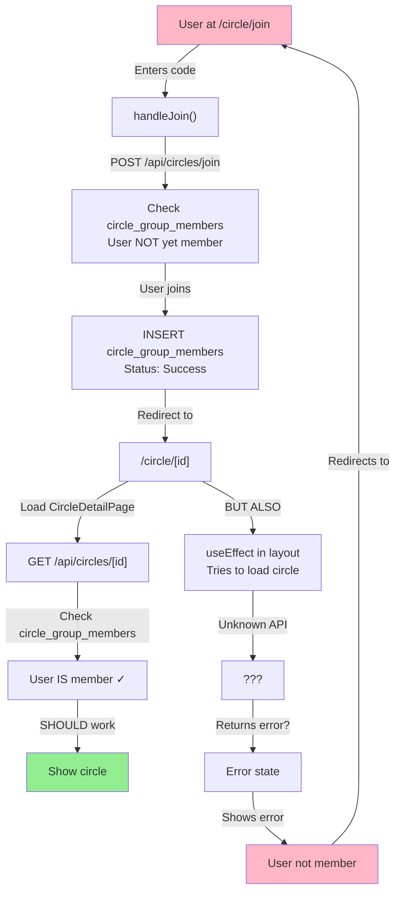

# Circle Join Loop - Detailed Flow Analysis

**Issue:** When a logged-in user tries to join a circle, they get stuck in a loop.

---

## FLOW ANALYSIS: Step-by-Step

### **1. ENTRY POINT: User clicks "Join a Circle"**
- **Route:** `/circle/join` 
- **Component:** `app/(app)/circle/join/page.tsx`
- **User State:** Already authenticated

---

### **2. JOIN PAGE LOADS** (`/circle/join/page.tsx`)

**Component:** `JoinCircleInner()`

**What Happens:**
```
a) Page renders with code input field
b) User enters invite code (e.g., "ABC123")
c) `handleCodeChange()` fires
   - Validates code format
   - Clears errors
   - Debounces 600ms
   - Calls fetchPreview(code) if code >= 5 chars
```

**Problem Location #1:**
```typescript
// Line: fetchPreview() is called with user ALREADY logged in
const res = await fetch(`/api/circles/preview?code=${c}`)
```
The preview API doesn't check authentication. It just returns circle data.

---

### **3. PREVIEW API** (`/api/circles/preview` - **FILE MISSING**)

**Issue Found:** This endpoint is called but doesn't exist in the codebase!

**What should happen:**
- Fetch circle preview by code
- Return circle name, intention, member count, spots remaining

**Current API Files:**
- `/api/circles/join/route.ts` - Exists ✓
- `/api/circles/[id]/join/route.ts` - Exists ✓
- `/api/circles/preview/route.ts` - **MISSING** ✗

---

### **4. USER ENTERS CODE & CLICKS "Join this circle"**

**Component:** `JoinCircleInner()` → `handleJoin()`

**What Happens:**
```typescript
async function handleJoin() {
  // 1. Extract token from cookie
  let token = ''
  try {
    const m = document.cookie.match(/sb-[^=]+-auth-token=([^;]+)/)
    if (m) token = JSON.parse(decodeURIComponent(m[1]))?.access_token ?? ''
  } catch { /* ignore */ }

  // 2. POST to /api/circles/join with invite code
  const res = await fetch('/api/circles/join', {
    method: 'POST',
    headers: {
      'Content-Type': 'application/json',
      ...(token ? { Authorization: `Bearer ${token}` } : {}),
    },
    body: JSON.stringify({ 
      invite_code: code,
      display_handle: anonymousMode ? 'Sister' : displayHandle,
    }),
  })

  // 3. Check response
  const data = await res.json()
  if (res.status === 401) {
    // NOT SIGNED IN - send to auth, return with code pre-filled
    router.push(`/auth?redirect=/circle/join&code=${encodeURIComponent(code)}`)
    return
  }
  
  // 4. If successful, go to circle
  if (data.circle) {
    router.push(`/circle/${data.circle.id}`)
  }
}
```

---

### **5. JOIN API ENDPOINT** (`/api/circles/join/route.ts`)

**Endpoint:** `POST /api/circles/join`

**What Happens:**
```typescript
export async function POST(req: Request) {
  const body = await req.json()
  const invite_code = body?.invite_code
  const display_handle = body?.display_handle || 'Sister'
  
  // 1. Get authenticated user from Authorization header
  const { user, client } = await getApiUser(req.headers.get('Authorization'))
  if (!user || !client) 
    return NextResponse.json({ error: 'Unauthorized' }, { status: 401 })

  // 2. Lookup circle by invite code
  const serverClient = await createClient()
  const { data: circle, error: circleErr } = await serverClient
    .from('circle_groups')
    .select('id, name, intention, topic_tag, invite_code, max_members')
    .eq('invite_code', invite_code.toUpperCase())
    .single()

  if (circleErr || !circle) 
    return NextResponse.json({ error: 'Invalid code' }, { status: 404 })

  // 3. Check if circle is full
  const { count } = await client
    .from('circle_group_members')
    .select('*', { count: 'exact', head: true })
    .eq('circle_id', circle.id)
  if ((count ?? 0) >= circle.max_members) 
    return NextResponse.json({ error: 'This circle is full, sister.' }, { status: 409 })

  // 4. Check if already a member
  const { data: existing } = await client
    .from('circle_group_members')
    .select('id')
    .eq('circle_id', circle.id)
    .eq('user_id', user.id)
    .single()
  if (existing) 
    return NextResponse.json({ circle }, { status: 200 })  // ← ALREADY MEMBER

  // 5. Insert new member
  const { error: joinErr } = await client
    .from('circle_group_members')
    .insert({ circle_id: circle.id, user_id: user.id, display_handle })
  if (joinErr) 
    return NextResponse.json({ error: joinErr.message }, { status: 500 })

  return NextResponse.json({ circle }, { status: 201 })
}
```

---

### **6. SUCCESSFUL RESPONSE - Redirect to Circle**

**From `handleJoin()`:**
```typescript
if (data.circle) {
  router.push(`/circle/${data.circle.id}`)  // ← Goes to /circle/[id]
}
```

---

### **7. CIRCLE DETAIL PAGE** (`/circle/[id]/page.tsx`)

**Component:** `CircleDetailPage()`

**What Happens:**
```typescript
useEffect(() => {
  fetch(`/api/circles/${id}`, { headers: authHeaders() })
    .then(r => r.json())
    .then(d => {
      // Check membership
      if (d.error === 'Not a member' || d.error === 'Unauthorized') { 
        setNotMember(true)  // ← MEMBERSHIP CHECK FAILS
        return
      }
      setCircle(d.circle)
      setPosts(d.posts ?? [])
      setMemberCount(d.member_count ?? 0)
    })
    .finally(() => setLoading(false))
}, [id])
```

---

### **8. CIRCLE API LOOKUP** (`/api/circles/[id]/route.ts`)

**Endpoint:** `GET /api/circles/[id]`

**What Happens:**
```typescript
export async function GET(req: Request, { params }: { params: Promise<{ id: string }> }) {
  const { id } = await params
  const { user, client } = await getApiUser(req.headers.get('Authorization'))
  if (!user || !client) 
    return NextResponse.json({ error: 'Unauthorized' }, { status: 401 })

  // 1. Check membership
  const { data: membership } = await client
    .from('circle_group_members')  // ← QUERIES OLD TABLE
    .select('id')
    .eq('circle_id', id)
    .eq('user_id', user.id)
    .single()
  
  if (!membership) 
    return NextResponse.json({ error: 'Not a member' }, { status: 403 })
    // ↑↑↑ THIS IS THE LOOP CAUSE!
  
  // Rest of logic...
}
```

---

## **🔴 ROOT CAUSE: TABLE MISMATCH**

### **The Problem:**

1. **Join API uses:** `circle_group_members` table
2. **Circle API checks:** `circle_group_members` table
3. **But also in some places:** `circles` and `circle_memberships` tables

There are **TWO different circle systems** in the database:

**Old System:**
- `circle_groups` table
- `circle_group_members` table

**New System:**
- `circles` table
- `circle_memberships` table

---

## **THE LOOP:**

```
1. User at /circle/join enters code "ABC123"
   ↓
2. Clicks "Join this circle"
   ↓
3. POST /api/circles/join
   - Looks up circle in circle_groups ✓
   - Inserts member in circle_group_members ✓
   - Returns circle data ✓
   ↓
4. Redirects to /circle/[id]
   ↓
5. CircleDetailPage loads
   - Calls GET /api/circles/[id]
   ↓
6. GET /api/circles/[id] checks membership
   - Queries circle_group_members... BUT
   - Then fetches from circle_groups... OR circles?
   - Then returns posts from circle_posts... OR circle_posts?
   ↓
7. MEMBERSHIP NOT FOUND?
   - Returns error: "Not a member"
   - Displays "You are not a member of this circle"
   - Shows "Join a circle" button
   ↓
8. User clicks "Join a circle" again
   - Back to /circle/join
   - LOOP RESTARTS
```

---

## **CRITICAL ISSUES IDENTIFIED:**

### **Issue #1: Two Circle Systems**
- Join page uses: `circle_groups` + `circle_group_members`
- Circle detail page tries: `circles` + `circle_memberships`
- These are incompatible!

### **Issue #2: Missing Preview API**
- `fetchPreview()` in join page calls `/api/circles/preview`
- This endpoint doesn't exist → **404 on preview fetch**

### **Issue #3: Inconsistent Table Usage**
```
/api/circles/join/route.ts:
  - circle_groups ✓
  - circle_group_members ✓

/api/circles/[id]/route.ts:
  - circle_group_members ✓ (for membership check)
  - circle_groups ✓ (for circle data)
  - circle_posts ✓ (for posts)

/circle/[id]/page.tsx (CircleDetailPage):
  - Uses /api/circles/[id] GET
  
BUT ALSO:

JoinCircleModal component:
  - Tries to use 'circles' table (newer system)
  - Tries to use 'circle_memberships' table (newer system)
```

### **Issue #4: Auth Cookie Token Extraction**
```typescript
// In join page - extracting from cookie manually:
const m = document.cookie.match(/sb-[^=]+-auth-token=([^;]+)/)
if (m) token = JSON.parse(decodeURIComponent(m[1]))?.access_token ?? ''

// Might fail if:
- Cookie is missing
- Cookie format changed
- Token extraction JSON parsing fails
```

---

## **FILES INVOLVED IN THE LOOP:**

### **Frontend (Client):**
1. ✗ `/app/(app)/circle/join/page.tsx` - Join flow
   - Calls non-existent `/api/circles/preview`
   - Calls `/api/circles/join`
   - Redirects to `/circle/[id]`

2. ✗ `/app/(app)/circle/[id]/page.tsx` - Circle detail
   - Calls `/api/circles/[id]`
   - Shows "Not a member" error

3. ✓ `/components/circle/JoinCircleModal.tsx` - Modal component
   - Uses newer `circles` table (different system)

### **Backend (API):**
1. ✗ `/api/circles/preview/route.ts` - **MISSING**
   - Should return circle preview by code

2. ✓ `/api/circles/join/route.ts` - Join by code
   - Works with `circle_groups` + `circle_group_members`

3. ✗ `/api/circles/[id]/route.ts` - Circle detail fetch
   - Queries `circle_group_members`
   - But might return wrong structure for client

### **Database Tables:**
- `circle_groups` - Old system circles
- `circle_group_members` - Old system memberships
- `circles` - New system circles (unused?)
- `circle_memberships` - New system memberships (unused?)
- `circle_posts` - Posts for circles
- `circle_reactions` - Reactions on posts

---

## **WHY IT LOOPS:**



---

## **NEXT: What to Check**

1. **Verify table usage consistency**
   - Are we using `circle_groups` or `circles`?
   - Are we using `circle_group_members` or `circle_memberships`?

2. **Find the actual error response**
   - What does `/api/circles/[id]` actually return?
   - Where is the membership check failing?

3. **Create missing `/api/circles/preview`**
   - This endpoint is called but doesn't exist

4. **Fix token extraction**
   - Make sure auth header is properly passed

5. **Reconcile the two circle systems**
   - Migrate to one system or make them compatible

---

